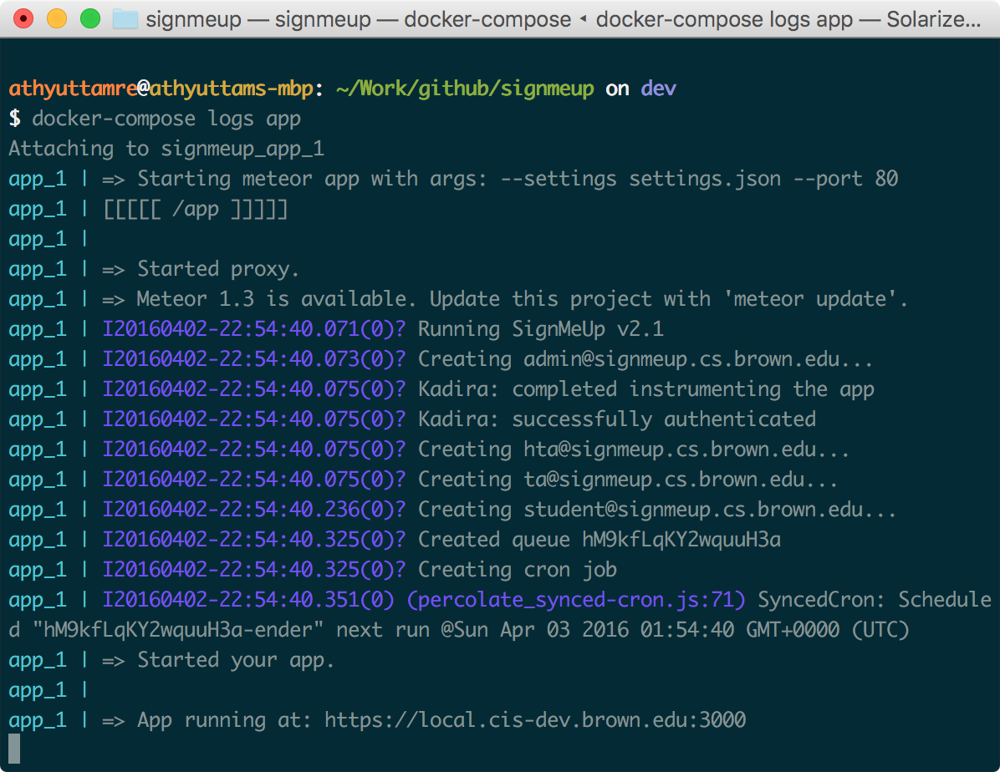

# Contributing

Here's a quick guide to developing SignMeUp and deploying it to production.

## Setup

Note that we only support development on Linux and OS X right now, since
`docker-compose` only works on those platforms.

1. Install Docker Toolbox (this should include `docker-machine` and `docker`),
   as well as `docker-compose`.

2. Clone this repository:

   ```shell
   $ git clone https://github.com/athyuttamre/signmeup.git
   ```

3. Generate self-signed certificates for `local.cis-dev.brown.edu` using
   http://selfsignedcertificate.com, and add the two files to the `nginx/ssl` folder. Change the certificate's extension from `.cert` to `.crt`.

4. In your terminal, run:

   ```shell
   $ sudo echo "$(docker-machine ip) local.cis-dev.brown.edu" | sudo tee -a /etc/hosts > /dev/null
   ```

   This adds a reference to your Docker Machine's IP address in your hosts file, allowing you
   to point your browser to `local.cis-dev.brown.edu` and load containers running on the Docker Machine.

   To check if the append worked, run `$ cat /etc/hosts` and make sure the line was added to the end.

   On Mac, to make sure your settings are applied, flush your DNS cache:

   ```shell
   $ dscacheutil -flushcache
   ```

   There are similar ways to flush the cache on Linux distributions.

5. `cd` into the `signmeup` directory, and proceed to create a `settings.json` file
   from `settings.template.json`:

    ```shell
    $ cp app/settings.template.json app/settings.json
    ```

6. Now we need to fill in various values inside `settings.json`.

   - Replace `INSERT-PASSWORD-HERE` with a good password.
   - Replace `saml.cert` with the IDP cert. You can get this by talking to the
     project coordinator. They will have to notify CIS before giving it to you
     so CIS knows who has this cert.
   - Replace `saml.serviceProviderCert` and `saml.decryptionPvk` with a *new*
     certificate/key pair from http://selfsignedcertificate.com. Skip the header
     and footer (The `---BEGIN...` and `---END...` parts). Also remove any newlines
     to make sure the values are in a single line.
   - Replace `appID` and `appSecret` with the correct values from kadira.io.

7. Finally, from the `signmeup` directory, run `docker-compose up`. The first
   time will take a long time since it'll pull all the dependent images along
   the way.

   Your code will be bind-mounted onto the Docker container, allowing
   you to edit in your text editor and see the changes in real-time.

8. Open your browser, and navigate to `https://local.cis-dev.brown.edu:3000`. You
   will probably receive a safety warning since you're using self-signed certs.
   Click on Advanced, and continue to the app.

9. Use `docker-compose logs` to see all the logs in realtime. Use
   `docker-compose logs app` to see just your Meteor app's logs.

<!-- TODO: Figure out Git workflow including the dev branch. -->

When running the local version of the app, you might notice that starting the
app container is slow, and sometimes takes a long time at `=> Starting proxy`.
This is normal, just wait it out.

If everything went well so far, you should see something like this when running `docker-compose logs app`:



## Development

TBD. Should include Git workflow and how to work with the `dev` branch and
feature branches.

## Production

Once your app is working well locally, and you're ready to deploy to production,
follow these steps:

1. Test that bundling works. Stop and remove all running containers, then run
   `make bundle-all`. This bundles your code into a Node app and runs it locally.
   Make sure this works.

2. If you're ready, push your changes to the GitHub repository.
   Create a pull-request for the `master` branch detailing your changes.

2. Once a collaborator has looked through your changes, merge the pull-request
   into `master`. Then create a new release on GitHub. Use semantic versioning.

3. Now, SSH into your Brown CS account. Then run `kinit`, and enter your password.
   Then type `ssh smu` to log in into the virtual machine.

4. `cd` into `/usr/local/docker/signmeup`.

  Because `docker-compose` isn't packaged for Debian yet
  (see [#2235](https://github.com/docker/compose/issues/2235)), we must run it in
  a Python `virtualenv`. Run `source venv/bin/activate` to start the virtual environment.
  Type `docker-compose` to make sure it's available.

   To deploy, run `make prod`.

   This will:
    - Pull the latest version of `master` from the Git repo
    - Load `settings.json` into an environment variable
    - Build an image for the new codebase
    - Run it with production settings

  It will not touch the already running `db` and `proxy` containers. For more
  deployment options, check out the `Makefile`.

## Docker Tips

If you accumulate a bunch of containers or images, clean-up with this: http://blog.yohanliyanage.com/2015/05/docker-clean-up-after-yourself/.
